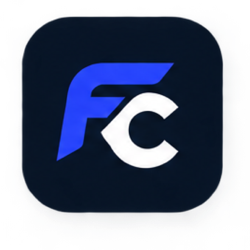

<p align="center">
  
</p>

<h1 align="center">FusionCross</h1>

<p align="center">
  <strong>Run Windows applications & games on macOS — the Mac way.</strong>
</p>

<p align="center">
  A high-performance, open-source Windows compatibility layer built for Apple Silicon Macs.<br />
  Powered by <strong>Tauri 2</strong>, <strong>Rust</strong>, <strong>React</strong>, <strong>Wine</strong>, <strong>Apple GPTK (D3DMetal)</strong>, and <strong>MSync</strong>.
</p>

<p align="center">
  <a href="https://github.com/OK45batwal/FusionCross/actions/workflows/ci.yml"></a>
  <a href="https://github.com/OK45batwal/FusionCross/releases"></a>
  <a href="LICENSE"></a>
  
  
  <a href="CHANGELOG.md"></a>
</p>

---

## Overview

FusionCross bridges the gap between Windows software and macOS. Instead of running a sluggish virtual machine with Windows license overhead, FusionCross translates Windows APIs directly into native macOS and Metal calls in user-space.

- **Zero Virtual Machine Overhead**: Direct execution with near-native CPU throughput on Apple Silicon (M1/M2/M3/M4).
- **100% Free & Open Source**: No recurring annual subscriptions like CrossOver or Parallels.
- **Apple HIG Design**: Minimalist Launchpad-style app grid, persistent bottle inspector, and dark/light theming.
- **Privacy-First**: No telemetry, no background tracking, no unsigned cloud analytics.

---

## Comparison Matrix

| Feature | CrossOver 24 | Whisky | Parallels Desktop | **FusionCross 2.0** |
|:---|:---:|:---:|:---:|:---:|
| **Cost** | $74 / year | Free (Open Source) | $99 / year | **100% Free (MIT)** |
| **Native Apple Silicon UI** | Swift / AppKit | Swift / SwiftUI | Mac App | **Tauri 2 + React + Rust** |
| **DirectX 11/12 (Apple GPTK)** | Included | Included | Emulated DX11 | **Native D3DMetal & DXMT** |
| **50+ Curated Game Catalog** | Searchable DB | Manual setup | Manual install | **Built-in 1-Click Recipes** |
| **Smart PE Header Analysis** | Basic | Basic | None | **Automated (Architecture/Subsystem)** |
| **Anti-Clutter Filtering** | Partial | Partial | N/A | **Strict Exclusions + Shelf Pruning** |
| **Export Standalone `.app`** | Yes | Yes | No | **1-Click Native `.app` Bundle** |
| **Diagnostics & Auto-Fix** | Limited | Limited | General | **11 Automated Health Checks** |
| **Virtual Machine Required** | No | No | Yes (Windows 11 VM) | **No (Direct Wine Translation)** |

---

## Architecture

FusionCross is engineered as a lightweight, safe desktop application using Tauri 2:

```
┌────────────────────────────────────────────────────────────────────────┐
│                        FRONTEND (Tauri / React)                        │
│   Left Sidebar           Center Stage              Right Inspector     │
│   [Bottles List]  ──►  [Application Shelf]  ──►  [Bottle Settings]    │
│   [50+ Catalog]        [Double-Click to Run]     [D3DMetal, MSync, HUD]│
└───────────────────────────────────┬────────────────────────────────────┘
                                    │ Type-Safe Tauri IPC
┌───────────────────────────────────▼────────────────────────────────────┐
│                        BACKEND (Rust Systems Core)                     │
│   ┌──────────────────────────────────────────────────────────────┐     │
│   │ Process Manager & Prefix Isolation Controller                │     │
│   │ (WINEPREFIX sandboxing, WINEDLLOVERRIDES, MSync flags)       │     │
│   └──────────────────────────────┬───────────────────────────────┘     │
│                                  │                                     │
│         ┌────────────────────────┴────────────────────────┐            │
│         ▼                                                 ▼            │
│   ┌───────────────┐                             ┌──────────────────┐   │
│   │  wineserver   │ (Process, Registry, IPC)   │ D3DMetal / DXVK  │   │
│   └───────┬───────┘                             └────────┬─────────┘   │
│           │ Mach Semaphores (MSync)                      │ Metal Calls │
│           ▼                                              ▼             │
│   ┌────────────────────────────────────────────────────────────────┐   │
│   │ macOS Kernel & Apple Silicon GPU (Metal API)                   │   │
│   └────────────────────────────────────────────────────────────────┘   │
└────────────────────────────────────────────────────────────────────────┘
```

---

## Key Features

### 🎮 50+ Game Catalog & 1-Click Recipes
Explore a verified library of top Windows games (Cyberpunk 2077, Elden Ring, Hades II, Baldur's Gate 3, GTA V, Persona 3 Reload, etc.). Each entry provides:
- Compatibility Tier (Platinum, Gold, Silver, Blocked).
- Pre-configured graphics engine (`d3dmetal`, `dxvk`, or `dxmt`).
- Optimal thread synchronization (`MSync`) and anti-cheat feasibility notes.
- 1-click official installer downloads.

### 📦 CrossOver-Style Launchpad UI
- **Spacious 64×64 App Grid**: High-resolution icons, clean labels, and subtle hover elevations.
- **Apple-Style Status Dots**: Pulsing emerald indicator displays which games and apps are actively running.
- **Contextual Menu**: Launch, Stop, Favorite, Reveal in Finder, Export as Mac App, or Remove from Shelf.

### 🛡️ Strict Anti-Clutter Filtering
- Automatically excludes helper executables, uninstallers (`unins000.exe`), crash handlers (`crashreporter.exe`, `unitycrashhandler64.exe`), and temporary installer stubs.
- Automatic database pruning ensures only genuine user applications populate your shelf.

### 🚀 Standalone macOS `.app` Export
Export any installed Windows program into a native `.app` bundle located in `~/Applications/FusionCross/`. Launch your Windows software directly from Spotlight, Alfred, Raycast, or the macOS Dock!

### 🔧 Automated Diagnostics & One-Click Repair
Run real-time health checks on your Wine prefixes:
- Verifies prefix directories, registry hives, and drive mappings.
- Detects missing Wine runtimes, broken symlinks, or GPU translation errors.
- One-click repair restores corrupt prefix symlinks without deleting user saves or data.

---

## Getting Started

### System Requirements
- **macOS 13.0 (Ventura)** or newer.
- **Apple Silicon Mac** (M1, M2, M3, M4 series).
- **Wine Runtime**: [Whisky-Wine](https://github.com/Whisky-App/Whisky) or `brew install --cask --no-quarantine wine-stable`.

### Installation

1. Download the latest `FusionCross-2.0.0-arm64.dmg` from the [Releases](https://github.com/OK45batwal/FusionCross/releases) page.
2. Open the DMG and drag **FusionCross.app** into your `/Applications` folder.
3. Open FusionCross and create your first Bottle or install software directly from the **Game Catalog**.

---

## Building from Source

### 1. Prerequisites
Install Xcode Command Line Tools, Node.js (v20+), and Rust:
```bash
xcode-select --install
curl --proto '=https' --tlsv1.2 -sSf https://sh.rustup.rs | sh
brew install node
```

### 2. Clone & Install Dependencies
```bash
git clone https://github.com/OK45batwal/FusionCross.git
cd FusionCross
npm install
```

### 3. Development Server
Run the desktop application with hot-module reload:
```bash
npm run tauri dev
```

### 4. Quality Checks & Tests
```bash
# Backend unit tests (32 tests)
cargo test --manifest-path src-tauri/Cargo.toml

# Formatting & Clippy linting
cargo fmt --manifest-path src-tauri/Cargo.toml -- --check
cargo clippy --manifest-path src-tauri/Cargo.toml --all-targets -- -D warnings

# Frontend ESLint & TypeScript verification
npm run lint
npx tsc --noEmit
```

### 5. Production Release Build
```bash
npm run tauri build
```

---

## Keyboard Shortcuts

| Shortcut | Action |
|:---|:---|
| <kbd>⌘</kbd> + <kbd>K</kbd> | Open Command Palette (Search apps, run diagnostics, switch bottles) |
| <kbd>⌘</kbd> + <kbd>N</kbd> | Create a new Bottle |
| <kbd>⌘</kbd> + <kbd>R</kbd> | Scan active bottle for new applications |
| <kbd>⌘</kbd> + <kbd>O</kbd> | Open C: Drive in macOS Finder |
| <kbd>⌘</kbd> + <kbd>Q</kbd> | Quit FusionCross |

---

## Repository Documentation

- [Changelog](CHANGELOG.md) — Version history and release notes.
- [Contributing Guide](CONTRIBUTING.md) — How to submit game recipes and code changes.
- [Code of Conduct](CODE_OF_CONDUCT.md) — Community standards and expectations.
- [Security Policy](SECURITY.md) — Vulnerability reporting and sandboxing architecture.
- [Product Requirements (PRD)](docs/PRD.md) — Full technical specification.
- [CrossOver Parity Roadmap](docs/CROSSOVER_PARITY_ROADMAP.md) — Feature parity milestones.
- [Test Plan](docs/TEST_PLAN.md) — 50-item verification rubric.

---

## License

FusionCross is free and open-source software licensed under the **[MIT License](LICENSE)**.
Created with pride by the FusionCross Contributors.
