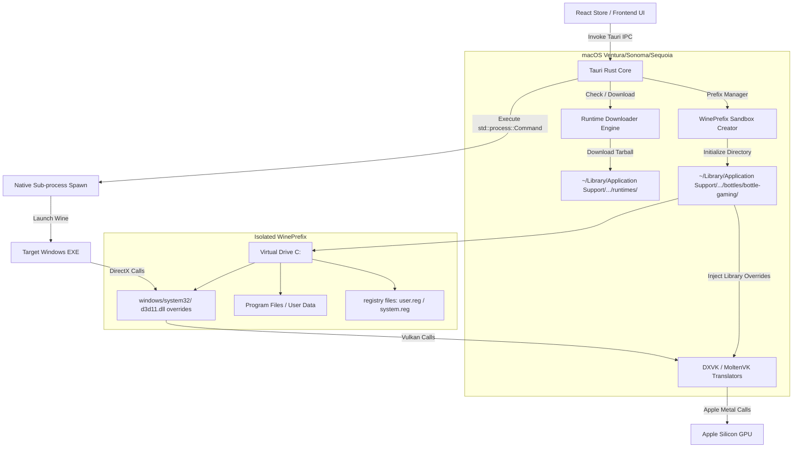

# WINE_SANDBOXING.md - Real Sandboxing & Wine Integration Blueprint

This document details the architectural blueprint and implementation roadmap to transition **FusionWine** from a premium interactive UI shell into a fully functional macOS-native Windows translation application runner (like CrossOver, Whisky, or Game Porting Toolkit).

---

## 🏗️ Core Architectural Design



---

## 🛠️ Step-by-Step Integration Plan

### 1. Dynamic Engine Downloader (On-Demand Provisioning)
Instead of packaging huge 2GB+ binaries in the initial `.dmg` package, implement an **On-Demand Downloader** that fetches custom pre-compiled Wine engines from a remote server (e.g., GitHub Releases).

* Use the **Whisky** (Wine-CX) or **Wineskin** build targets which are specifically optimized for Apple Silicon (ARM64) and macOS.

**Rust implementation outline in `src-tauri/src/main.rs`:**
```rust
#[tauri::command]
async fn download_wine_engine(engine_url: String, target_id: String) -> Result<(), String> {
    // 1. Resolve localized App Support directory
    let path = "/Users/omkar/Library/Application Support/com.omkar.fusionwine/runtimes/";
    
    // 2. Stream HTTP download of compressed tarball (.tar.xz or .tar.gz)
    // 3. Extract contents into the target runtimes folder
    // 4. Set executable chmod permissions
    Ok(())
}
```

---

### 2. WinePrefix Sandboxing & VFS Isolation
A **WinePrefix** is a self-contained, virtual Windows environment. It operates completely isolated from other applications and has its own drive configuration, registry values, and system libraries.

* **Sandboxing Trigger**: To sandbox a prefix, set the `WINEPREFIX` environment variable to the unique bottle directory before calling any Wine command.

**How to initialize a new sandbox prefix in Rust:**
```rust
use std::process::Command;

#[tauri::command]
fn initialize_prefix_sandbox(bottle_path: String, wine_path: String) -> Result<(), String> {
    // Run wineboot in background to generate clean C: drive and registries
    let status = Command::new(wine_path)
        .env("WINEPREFIX", &bottle_path)
        .arg("wineboot")
        .arg("-u") // Update/Initialize flag
        .status()
        .map_err(|e| e.to_string())?;

    if status.success() {
        Ok(())
    } else {
        Err("Failed to bootstrap WinePrefix sandbox".to_string())
    }
}
```

---

### 3. Graphics Translation Pipeline (DirectX ➡️ Vulkan ➡️ Metal)
macOS does not natively support Vulkan or DirectX. Running high-performance games requires a double-translation layer:

1. **DXVK (`d3d9.dll`, `d3d10.dll`, `d3d11.dll`, `dxgi.dll`)**:
   Translates DirectX API calls made by the game into Vulkan commands.
2. **MoltenVK (`libMoltenVK.dylib`)**:
   Translates Vulkan commands into native Apple Metal API calls executed directly by Apple Silicon GPU shaders.

**To implement this in FusionWine:**
* Download pre-built DXVK `.dll` libraries.
* Copy them directly into the bottle's `drive_c/windows/system32/` folder.
* Configure **DLL Overrides** in the registry (via `system.reg`) to force the game to load the custom DXVK libraries rather than standard Wine stubs:
  ```ini
  [Software\\Wine\\DllOverrides]
  "d3d11"="native,builtin"
  "dxgi"="native,builtin"
  ```

---

### 4. Spawning the Executable with Process Hooks
To execute the game or utility, use Rust's `std::process::Command` to launch the Wine runner, passing environmental variables to tune execution.

```rust
use std::process::{Command, Stdio};
use std::io::{BufRead, BufReader};

#[tauri::command]
fn execute_windows_binary(
    wine_path: String,
    prefix_path: String,
    exe_path: String,
    arguments: String,
    app_handle: tauri::AppHandle
) -> Result<(), String> {
    
    std::thread::spawn(move || {
        let mut child = Command::new(wine_path)
            .env("WINEPREFIX", &prefix_path)
            .env("DXVK_HUD", "fps") // Shows active FPS HUD on-screen
            .env("WINEESYNC", "1")  // Enables Eventfd-based synchronization (boosts performance)
            .env("WINEFSYNC", "1")  // Enables Futex-based synchronization
            .arg(exe_path)
            .arg(arguments)
            .stdout(Stdio::piped())
            .stderr(Stdio::piped())
            .spawn()
            .expect("Failed to execute Wine sub-process");

        // Hook stderr to stream actual Wine telemetry back to the React UI terminal console!
        let reader = BufReader::new(child.stderr.take().unwrap());
        for line in reader.lines() {
            if let Ok(log) = line {
                let _ = app_handle.emit("wine-log-stream", log);
            }
        }
    });

    Ok(())
}
```

---

### 5. Dependency Automation (Winetricks Integration)
Many Windows programs require specific runtime frameworks (e.g., `.NET Framework`, `Visual C++ Redistributable`, `DirectX Web Installer`) to run.
* Package a lightweight **Winetricks** shell script with the application.
* Winetricks is a package manager helper that automatically downloads and runs installation installers silently inside your custom WinePrefix.
* Expose a *"System Libraries & Packages"* installation list in the UI (e.g., `vcrun2022`, `d3dx11`, `dotnet48`) and execute Winetricks silently:
  `sh winetricks --prefix "/path/to/bottle" vcrun2022`
